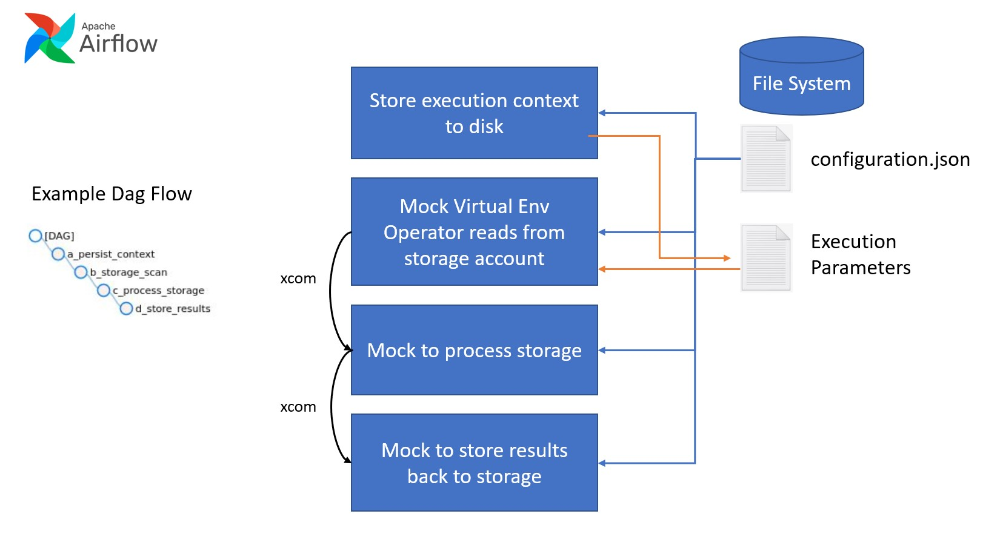

# AirflowDagExample

This example shows how to construct an Apache Airflow DAG out of PythonOperator and PythonVirtualenvOperator tasks. 

## Overview



The example DAG is made up of 4 stages. 

> Each of the stages utilizes the exampleconf.json file to show how that data can be shared across tasks in a DAG.<br><br>This might be where an author is storing general configuration to use across stages as it relates to thier environment.<br><br>The PythonVirtualEnvOperator does not have access to the configuration that is passed to the DAG at execution time. Of course, that will be critical information for the task to complete it's execution in most cases.<br><br>To resolve that, the example uses the first task to persist the execution parameters to disk which is then picked up by the PythonVirtualenvOperator task.  

|Stage|Operator|Description|
|----|----|---|
|a_persist_context|PythonOperator|<ul><li>Recieves the content of the configuration which instructs where to persist the execution parameters.</li><li>Retrieves the execution parameters from the DAG context and writes them to the file system.</li><li>Returns nothing</li></ul>|
|b_storage_scan|PythonVirtualEnvOperator|<ul><li>Recieves the content of the configuration which instructs where to read persisted execution parameters.</li><li>Performs it's main task</li><li>Returns a JSON serialized object to be consumed by the c_process_storage stage.</li></ul>|
|c_process_storage|PythonOperator|<ul><li>Recieves the content of the configuration and also has access to the raw execution configuration</li><li>Performs it's main task</li><li>Returns a JSON serialized object to be consumed by the d_process_storage stage.</li></ul>|
|d_store_results|PythonOperator|<ul><li>Recieves the content of the configuration and also has access to the raw execution configuration</li><li>Performs it's main task</li><li>Returns nothing</li></ul>|

<sub>In the above steps there is really no "main task" to execute as they are all mock steps other than the persisting of the execution context. This was done intentionally as to not fill up the source files and confuse teh flow</sub>


## Setup
To test this example you will need to follow the instructions below. 

1. Create a Virtual Machine in Azure (I chose the Ubuntu DSVM because it has a bunch of needed tools already installed)
2. Create a conda environment with this environment file. It includes data from the public ODSU work done by Microsoft/Google and others:
```
name: AirflowEnv
channels:
  - conda-forge
dependencies:
  - python=3.9.2
  - pip==21.2.4
  - virtualenv
  - azure-identity==1.5.0
  - azure-keyvault-secrets==4.2.0
  - azure-storage-blob
  - azure-servicebus==7.0.1
  - requests==2.25.1
```

3. Activate the environment
> conda activate AirflowEnv
4. Follow all of the [Airflow run local](https://airflow.apache.org/docs/apache-airflow/stable/start/local.html)
    - Ensure you run airflow standalone at least once to seed it. 
5. Drop the aiinfraexample folder into the Airflow dag folder. You can find this by running the command
> airflow info
```
Apache Airflow
version                | 2.2.1                                              
...
--> dags_folder            | /home/YOURUSER/airflow/dags                          
...
```
6. Restart airflow (airflow standalone)

> NOTE: When airflow is running you will not be able to create a file or folder under the dags folder. Simply shut it down and then create what you need. 

## Source Code
The main DAG file is located at aiinfraexample/exampledag.py. 

This DAG is comprised of 4 tasks/stages each comprised of Python source you will find in the aiinfraexample/utils folder. 

The aiinfraexample/exampleconf.json is the base configuration that is passed to each of the task/stages from the main DAG file. 

## Open ODSU Info

[Chart YML](https://community.opengroup.org/osdu/platform/deployment-and-operations/infra-azure-provisioning/-/blob/master/charts/airflow/helm-config.yaml#L331) shows that the following are already in the environment...so include these in the AirFlow environment.

```
        "azure-identity==1.5.0",
        "azure-keyvault-secrets==4.2.0",
        "azure-storage-blob",
        "azure-servicebus==7.0.1",
        ...
        "jsonschema==3.2.0",
        "pyyaml==5.4.1",
        "requests==2.25.1",
```
# Credentials
Testing this with multiple types of credentials.

## Service Principal
- Owner role on Subscription
  - Provides access to list resources/ get storage keys
- Storage Blob Data Contributor (storage account)
  - Allows iterating containers/blobs in storage


## User managed identity
- Reader role (sub)
  - Provides access to list resources 
- Storage Account Contributor (Sub)
  - Allow access to get keys from storage
- Storage Blob Data Contributor (storage account)
  - Allows iterating containers/blobs in storage

